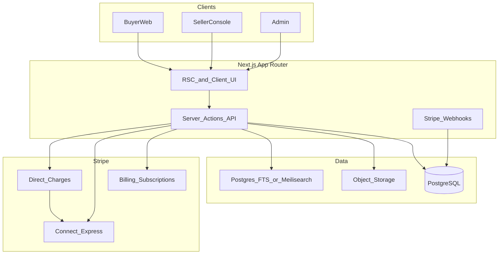
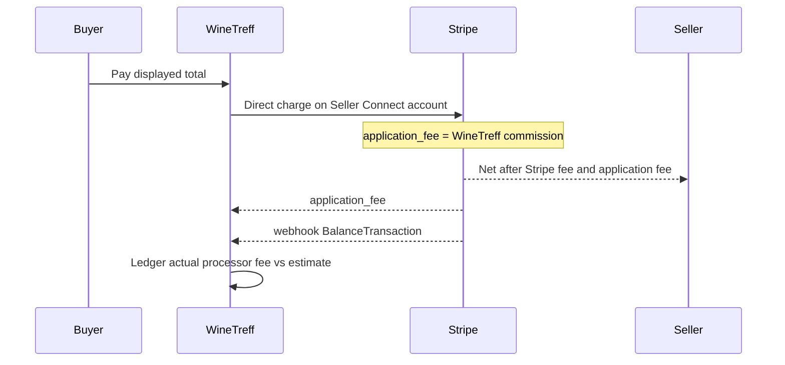

# WineTreff — Product & Engineering Plan

**Status:** Approved defaults (2026-08-18)  
**Product:** Original fixed-price marketplace for wines, spirits, rare bottles, and beverage-related collectibles.  
**UX reference:** AutoScout24.de for *organization only* (search-first discovery, rich listings, merchant accounts, saved searches, comparisons, regional discovery, promo placements, editorial). No branding, content, imagery, code, schema, or pixel-level UI copy.

---

## 1. Locked decisions

| Decision | Choice |
|---|---|
| First shippable slice | **Marketplace foundation** (Phase 1), with schema/API hooks for Phase 2 discovery features |
| Stack | Next.js (App Router) + TypeScript + PostgreSQL + Prisma + Auth.js (credentials + OAuth) + Stripe + Tailwind CSS |
| Payments | Stripe Connect **Express** (direct charges) + Stripe Billing for seller plans |
| Hosting target | Vercel (app) + managed Postgres (Neon or Supabase) + R2/S3 for media |
| Market | DACH/EU-first, EUR primary, 18+ age gate |
| Sellers | Private collectors and commercial merchants on the same plan ladder |
| Fulfillment | **Seller-managed only** — WineTreff does not pack, ship, warehouse, or deliver orders |
| Listing model | Fixed price only — no auctions, bids, reserves, make-an-offer, or gift cards |
| Buyer fees | **None** from WineTreff (no commission, premium, transaction fee, Buy Again, search, or basic AI fees) |
| Monetization | Seller subscription + completed-sale commission; payment-processing costs deducted from seller proceeds and disclosed separately |

---

## 2. Commercial model

### Seller plans

| Plan | Monthly | Completed-sale commission |
|---|---:|---:|
| Starter | €0 | 10% |
| Merchant | €49 | 7% |
| Professional | €149 | 5% |
| Enterprise | from €399 | negotiated 3.5%–4.5% |

- Subscriptions billed via Stripe Billing to the seller.
- Active plan stores `commissionBps` (e.g. 1000 = 10%) on the seller account; Enterprise rates are admin-set within 350–450 bps.
- Commission applies to the **listing/product subtotal** (ex-shipping). Shipping is pass-through to the seller. Tax/excise/customs lines follow the tax configuration (collected from buyer; remittance policy documented per jurisdiction).
- Each seller is solely responsible for packing, dispatch, carrier selection, tracking, delivery communication, and compliance with the shipping rules applicable to their sale. WineTreff provides marketplace records and destination controls, not fulfillment services.

### Buyer pays only

- Displayed product price  
- Stated shipping  
- Applicable taxes, excise duties, customs  

### Seller settlement (per completed sale)

```
buyer_charge     = product + shipping + tax_lines
winetreff_fee    = product * commission_rate     // WineTreff commission only
processor_fee    = actual Stripe fee (BalanceTransaction)
                   // planning estimate: 2.5% + €0.25 of buyer_charge
seller_proceeds  = buyer_charge - winetreff_fee - processor_fee
                   // minus any tax amount WineTreff remits on seller's behalf
```

**Disclosure:** Order/seller statements show three separate lines: product+shipping gross, WineTreff commission, payment-processing fee (estimate at checkout preview; actual after settlement).

**Stripe mechanics:** Direct charges on the seller’s Connect Express account with `application_fee_amount = winetreff_fee`. Stripe’s processing fee then lands on the connected account (seller), matching “deduct from seller proceeds.” Ledger stores estimated fee at intent creation and actual fee from webhook/`BalanceTransaction`.

---

## 3. Phase scope

### Phase 1 — Marketplace foundation (this build)

1. **Auth & profiles** — buyer/seller roles, 18+ affirmation, seller KYC via Stripe Connect onboarding  
2. **Catalog & search-first browse** — faceted search (category, region, vintage, price, merchant, condition, bottle size), sort, pagination  
3. **Listing detail** — gallery, provenance/condition, tasting notes fields, merchant card, shipping matrix, fixed price + buy CTA  
4. **Seller console** — create/edit listings, inventory, orders, payout status, plan & fees dashboard  
5. **Checkout** — single-seller cart → Stripe Checkout/PaymentIntent (direct charge), order confirmation  
6. **Subscriptions** — Starter default; upgrade Merchant/Professional via Billing; Enterprise via admin invite  
7. **Commission & fee ledger** — immutable sale settlement records with commission vs processor fee split  
8. **Merchant public pages** — storefront by seller slug  
9. **Basics** — age gate, legal pages stubs, email transactional hooks, admin moderation (list/unlist)  
10. **Seed & docs** — sample listings, env template, README, runbook  

**Fulfillment boundary:** Phase 1 does not include WineTreff-operated warehousing, packing, shipping, carrier purchasing, or delivery. Sellers fulfill their own orders. Marketplace features may record shipping charges, eligible destinations, order status, and seller-provided tracking details.

### Phase 2 — Discovery surface (schema ready in Phase 1; UI after foundation)

- Saved searches + email/push alerts  
- Side-by-side product comparison (≤4 listings)  
- Regional discovery (map/region hubs: Bordeaux, Speyside, Mosel, etc.)  
- Promotional listings (boosted placement purchased by sellers)  
- Editorial CMS (guides, producer stories)  

### Explicitly out of scope (all phases unless revisited)

- Auctions / bidding / reserve / make-an-offer  
- Gift cards  
- Buyer-side marketplace fees  
- Copying AutoScout24 branding, assets, copy, or layout verbatim  

---

## 4. Architecture



### Money flow



---

## 5. Domain model (Prisma-oriented)

Core entities:

- `User` — auth identity, ageVerifiedAt, roles  
- `SellerProfile` — display name, slug, bio, region, Stripe Connect ids, `planId`, `commissionBps`, onboarding status  
- `SellerPlan` — enum/table: STARTER / MERCHANT / PROFESSIONAL / ENTERPRISE + monthlyPriceCents + defaultCommissionBps  
- `Subscription` — Stripe subscription id, status, currentPeriodEnd  
- `Category` / `Region` / `Producer` — taxonomy for wine/spirits/collectibles  
- `Listing` — title, slug, description, category, attributes (JSON: vintage, ABV, size, condition, fill level, label condition), priceCents, shippingRules, status (DRAFT/ACTIVE/SOLD/UNLISTED), promoRank (Phase 2), sellerId  
- `ListingImage`  
- `Order` / `OrderItem` — buyer, seller, amounts breakdown  
- `Settlement` — productSubtotal, shipping, tax, commissionAmount, processorFeeEstimated, processorFeeActual, sellerPayout, currency, stripePaymentIntentId, stripeBalanceTxId  
- `SavedSearch`, `ComparisonSet` — Phase 2 tables created early, unused in UI until Phase 2  
- `EditorialPost` — Phase 2 stub  
- `AuditLog` — plan changes, moderation, Enterprise commission overrides  

**Invariants**

- Listing `saleType = FIXED` only (column or enum with single value; no auction fields).  
- Buyer invoice lines never include WineTreff commission or “platform fee.”  
- Settlement always stores commission and processor fee as separate columns.  

---

## 6. App routes (Phase 1)

| Route | Purpose |
|---|---|
| `/` | Search-first home (hero brand + search + featured grid below fold) |
| `/search` | Faceted results |
| `/listings/[slug]` | Detail |
| `/merchants/[slug]` | Merchant storefront |
| `/cart`, `/checkout`, `/orders/[id]` | Purchase flow |
| `/sell`, `/sell/listings`, `/sell/orders`, `/sell/payouts`, `/sell/plan` | Seller console |
| `/account` | Buyer account |
| `/admin` | Moderation + Enterprise plan tooling |
| `/api/webhooks/stripe` | Billing + Connect + payment events |
| `/legal/*` | Terms, privacy, seller fees disclosure |

Phase 2 routes (reserved): `/compare`, `/regions/[slug]`, `/saved-searches`, `/editorial/[slug]`.

---

## 7. Fee engine

Module: `src/lib/commerce/fees.ts`

```ts
// Pseudocode of locked rules
estimateProcessorFeeCents(amountCents) =>
  Math.round(amountCents * 0.025) + 25

commissionCents(productSubtotalCents, commissionBps) =>
  Math.round(productSubtotalCents * commissionBps / 10000)

// Buyer-facing total never adds commission or processor fee
buyerTotalCents = product + shipping + taxes

// Seller statement
sellerNetEstimate = buyerTotal - commission - estimateProcessorFee(buyerTotal)
```

On `payment_intent.succeeded` / `charge.succeeded`, resolve `BalanceTransaction.fee` → write `processorFeeActual` and finalize `sellerPayout`.

---

## 8. Compliance & trust (MVP bar)

- Hard 18+ gate before browse/checkout; store affirmation timestamp.  
- Seller fee page: clear table of plans, commissions, and that buyers do not pay WineTreff fees.  
- Checkout UI shows buyer total components only (price, shipping, tax).  
- Alcohol shipping: sellers declare ship-to countries; checkout blocks unsupported destinations.  
- Sellers are responsible for fulfillment and shipping compliance; WineTreff does not take custody of goods or act as the carrier.  
- No legal advice in product copy; link to counsel-reviewed terms placeholders.  

---

## 9. Design direction

Original WineTreff brand — not AutoScout24 clone:

- Search-first composition; brand as hero signal on landing.  
- Full-bleed atmospheric hero (cellar / bottle photography placeholders), then search.  
- Expressive typography (distinct display + text pair; avoid Inter/Roboto defaults).  
- Deep wine-cellar palette (ink, bottle green, warm paper accents) — avoid purple-gradient / cream-serif-terracotta AI clichés.  
- Cards only for interactive listing tiles and form surfaces.  
- 2–3 intentional motions (search focus, listing image crossfade, seller console feedback).  

---

## 10. Repo layout

```
/apps or root Next app
  app/                 # App Router
  components/
  lib/
    auth/
    commerce/          # fees, settlement, plans
    stripe/
    search/
  prisma/
    schema.prisma
    seed.ts
  docs/
    PLAN.md            # this file
    FEES.md            # buyer/seller fee disclosure source of truth
  public/
  .env.example
  README.md
```

---

## 11. Implementation order

1. Scaffold Next.js + Prisma schema + seed plans/categories  
2. Auth + age gate + role model  
3. Listings CRUD + public detail + merchant pages  
4. Search (Postgres `tsvector` initially; Meilisearch if latency demands)  
5. Stripe Connect onboarding + Billing plans  
6. Checkout + webhook settlement ledger  
7. Seller plan dashboard + fee disclosure UI  
8. Admin Enterprise commission + moderation  
9. Polish design system + seed demo catalog  
10. README / env / local Stripe CLI runbook  

Phase 2 follows only after Phase 1 checkout and settlement are verified end-to-end in test mode.

---

## 12. Acceptance criteria (Phase 1 done)

- Buyer can find a listing via search, open detail, pay fixed price; receipt shows **no** WineTreff buyer fee.  
- Seller on Starter sees 10% commission and separate processor fee on settlement; upgrading to Merchant updates commission to 7% for subsequent sales.  
- Enterprise seller can be set to e.g. 4.0% by admin.  
- Payment-processing line uses 2.5%+€0.25 for previews and Stripe actual fee post-capture.  
- No UI or API paths for auction/offer/gift card.  
- Original branding throughout; AutoScout24 not referenced in product UI.  

---

## 13. Risks & mitigations

| Risk | Mitigation |
|---|---|
| Alcohol / cross-border shipping law | Destination allowlists; seller attestation; legal stubs |
| Stripe fee attribution | Direct charges so processor fee hits Connect account |
| Commission disputes | Immutable `Settlement` rows + audit log |
| Scope creep into Phase 2 | Phase 2 tables only; no UI until foundation green |
| Search quality | Start with Postgres FTS + facets; upgrade path documented |
